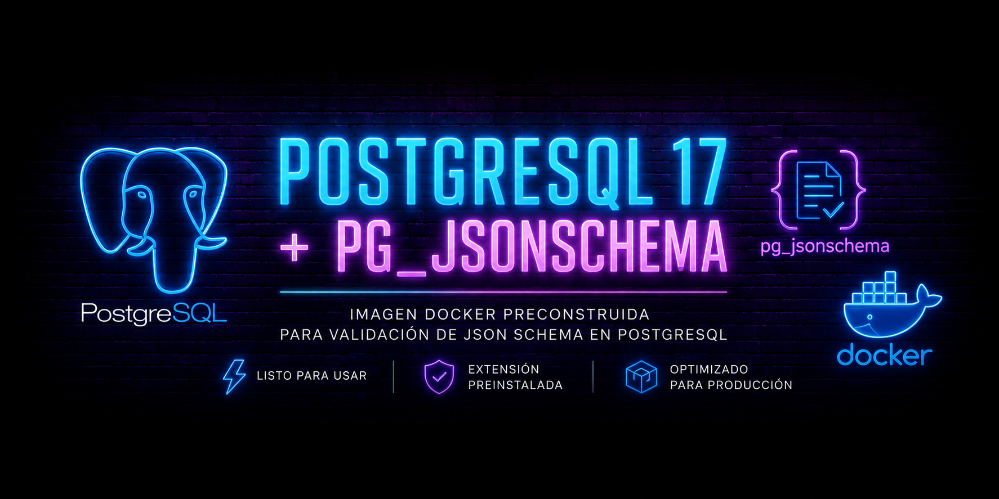

# 🐘 PostgreSQL 17 + JSON Schema

Imagen Docker basada en PostgreSQL 17 que incorpora la extensión **pg_jsonschema** preinstalada y lista para usar.

---

## 🔗 Links

 **Docker Hub:** https://hub.docker.com/r/devalejandrosaa/postgres17-jsonschema  
 **GitHub:** https://github.com/devalejandrosaa/postgres17-jsonschema

---

## 🎯 Objective

Facilitate the use of JSON Schema validations directly from PostgreSQL without the need to manually compile extensions or set up Rust development environments.

The image includes all the necessary components to create and use the extension:

```sql
CREATE EXTENSION pg_jsonschema;
```

---

## 📦 Included Versions

| Component    | Version |
| ------------ | ------- |
| PostgreSQL   | 17.10   |
| pg_jsonschema | 0.3.4  |
| Rust         | 1.91.1  |
| cargo-pgrx   | 0.16.1  |

---

## 🚀 Quick Start

### Run PostgreSQL

```bash
docker run -d \
  --name postgres17-jsonschema \
  -e POSTGRES_PASSWORD=password \
  -p 5432:5432 \
  devalejandrosaa/postgres17-jsonschema:17.10-0.3.4
```

### Enable the extension

```sql
CREATE EXTENSION pg_jsonschema;
```

### Verify installation

```sql
SELECT extname
FROM pg_extension
WHERE extname = 'pg_jsonschema';
```

---

## 🏗️ Build Process

The image is built using a multi-stage process to reduce the final size and avoid including unnecessary tools in production.

### Build stage

The following are used:

* Rust 1.91.1
* cargo-pgrx 0.16.1
* PostgreSQL 17 Development Headers
* LLVM
* Clang

During compilation:

1. `cargo-pgrx` is installed.
2. Only PostgreSQL 17 is initialized.
3. The source code of `pg_jsonschema` is downloaded.
4. The extension is compiled.
5. Debug symbols are removed using `strip`.

### Final stage

The final image uses:

```text
postgres:17
```

Only the necessary files are copied:

```text
/usr/lib/postgresql/17/lib/pg_jsonschema.so
/usr/share/postgresql/17/extension/pg_jsonschema.control
/usr/share/postgresql/17/extension/pg_jsonschema--*.sql
```

This significantly reduces the final image size.

---

## 📂 Installed files

```text
/usr/lib/postgresql/17/lib/pg_jsonschema.so
/usr/share/postgresql/17/extension/pg_jsonschema.control
/usr/share/postgresql/17/extension/pg_jsonschema--0.3.4.sql
```

---

## 📈 Versioning

The project uses the following scheme:

```text
<postgresql-version>-<pg_jsonschema-version>
```

Examples:

```text
17.10-0.3.4
17.10-0.3.5
17.11-0.3.5
```

---

## 🏷️ Releases

Each released version generates:

* A Git tag.
* A GitHub release.
* A corresponding Docker Hub tag.

Example:

```text
GitHub Release:
v17.10-0.3.4

Docker Image:
17.10-0.3.4
```

---

## 📋 Roadmap

### PostgreSQL 17

* Maintain compatibility with PostgreSQL 17.
* Incorporate new versions of pg_jsonschema.
* Publish new versioned images.
* Maintain historical tags for reproducibility.

---

## 🤝 Contributions

Contributions, bug reports, and improvements are welcome via Issues and Pull Requests.

---

## 📜 License

MIT License.